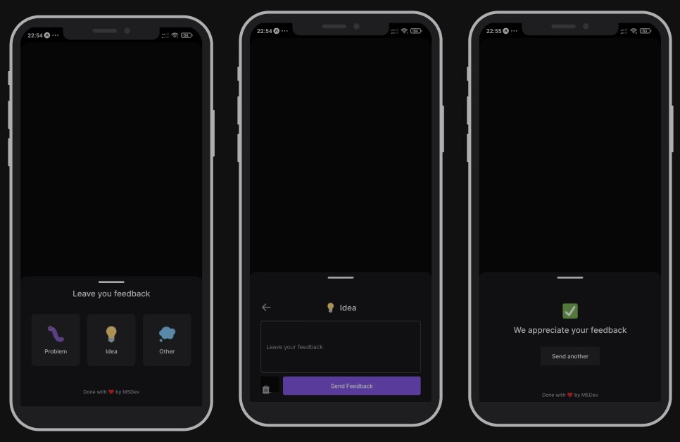

# Feedback Mobile

## Tech used:

- **Frontend**: [Expo](https://expo.dev/)
- **Lib**: [React Native](https://reactnative.dev/) & [Typescript](https://www.typescriptlang.org/)
- **Icons**: [Phosphor-react](https://phosphoricons.com/)
- **Http**: [Axios](https://axios-http.com/)

## Screenshots



## Overview

This project was developed in the [Rocketseat](https://www.rocketseat.com.br/) Next Level Week Return.
The application allows you to leave feedback from a android or ios app and also have a [web](https://github.com/msdevpt/nlw-return-impulse-web) version and [server](https://github.com/msdevpt/nlw-return-impulse-server).

## Running Locally

This application requires Node.js v18+.

```bash
$ git clone https://github.com/msdevpt/nlw-return-impulse-mobile.git
$ cd nlw-return-impulse-mobile
$ yarn
$ yarn start
```

Create a `.env` file similar to [`.env.example`](https://github.com/msdevpt/nlw-return-impulse-mobile/blob/main/.env.example).

## Credits

- [Rocketseat](https://www.rocketseat.com.br/) 
- [Design](https://www.figma.com/file/gI2bEhIGwT1tT3Tbr5tEwG/Feedback-Widget-Community)